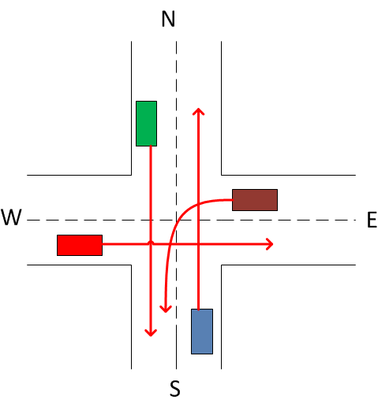

# Лабораторная работа 3: Создание многопоточного приложения

## Описание

В данной работе необходимо создать многопоточное приложение, моделирующее работу интеллектуального светофора на перекрестке. Приложение должно эмулировать движение машин, подъезжающих к перекрестку, с учетом их направления и синхронизации.

Светофор контролирует движение машин, обеспечивая параллельное движение автомобилей, чьи траектории не пересекаются. Если траектории автомобилей пересекаются, они двигаются поочередно. 

### Модель

Перекресток состоит из четырёх направлений:
- север (north),
- запад (west),
- юг (south),
- восток (east).

Каждое направление может принимать автомобили, которые встают в очередь перед светофором. Приложение отслеживает возможные пересечения траекторий машин и синхронизирует их движение.

Машины могут двигаться в одном из следующих направлений относительно себя:
- Straight (прямо)
- Left (налево)
- Right (направо)

Светофор реализует синхронизацию потоков с использованием механизма `CyclicBarrier`, который обеспечивает, что все потоки будут готовы к выполнению перед началом движения. Каждый поток (автомобиль) может двигаться только тогда, когда это безопасно и не нарушает синхронизации с другими машинами. Например, автомобили, движущиеся с направлений `north-straight`(зеленая машина) и `south-straight`(синяя машина), могут двигаться одновременно, так как их пути не пересекаются, а `west-straight`(красная), `east-left`(коричневая) - почередно.

### Основные компоненты

- **Автомобили (потоки)**: Каждый поток представляет машину, которая подъезжает к перекрестку. У каждого потока есть два параметра: направление движения и сторона, с которой он подъехал.
- **Светофор**: Контролирует, какие автомобили могут двигаться одновременно, и синхронизирует потоки с помощью `CyclicBarrier`.
- **MultiValueMap**: Структура данных для хранения направлений движения машин и их возможных параллельных направлений.

### Принципы работы

1. **Синхронизация потоков**: Каждый поток (машина) перед движением синхронизируется с другими потоками, чтобы избежать конфликтов на перекрестке.
2. **Параллельное движение**: Машины могут двигаться параллельно, если их траектории не пересекаются.
3. **Очередность движения**: Если траектории машин пересекаются, они едут поочередно.

### Тестирование

Приложение включает тесты для проверки корректности работы с потоками:
- Проверка наличия deadlock.
- Проверка гонок за ресурсами.

## Используемые технологии
- `CyclicBarrier`: Для синхронизации потоков.
- [`MultiValueMap`](https://github.com/ukQueen/Java_Lab2): Для хранения возможных направлений движения автомобилей.

